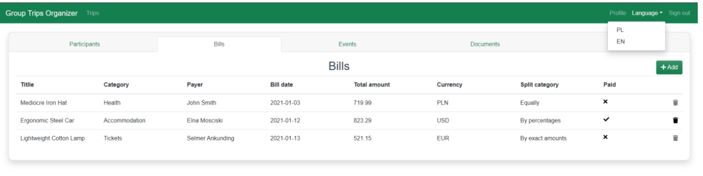

# Group Trip Organizing - Web application

The purpose of this application is to enhance communication and improve the coordination of trip participants. It will provide the following key features:

- **Expense Splitting:** The application will enable participants to split shared expenses, making financial coordination easier.

- **Document Sharing:** Participants can share trip-related documents such as tickets, bills, and reservations through the platform.

- **Event Information:** The application will offer functionality to share information about important events scheduled during the trip and other relevant details .

The app is primarily intended to streamline the logistics of the trip, simplify the expense accounting process with currency conversion functionality, and provide a place to share details of the planned trip together. The app is expected to provide a comprehensive source of information about the group trip in a convenient-to-use and intuitive format, allowing you to enjoy trip together.

This app is available in two languages: **English** and **Polish**.

## Screenshots

When there are 5 consecutive failed login attempts within 1 hour, the user is temporarily blocked from logging in for 10 minutes. This security measure prevents brute force and dictionary attacks aimed at gaining unauthorized access to the user's account.

Unauthorized users can create an account by entering their personal information. Upon verifying the data's accuracy and email address uniqueness, the system sends an activation link to the provided email for completing the registration and activating the account.

The system sends an e-mail with an activation link in the preferred language - Polish or English.

The system presents a list of tours of the currently logged-in user and allows you to select a tour.

The application is available in two language versions - Polish and English.

The application's interface is responsive to respond appropriately to the different sizes and aspect ratios of users' screens. 

The interface displays a list of bills that belong to the tour. The application also provides support for currency conversion. The user can use this functionality to convert the amount into the selected currency according to the exchange rate on the date of the expense. The rate is available from the service of the National Bank of Poland, which makes current and archived exchange rates publicly available.

The application allows to split the bill evenly or unevenly by percentages, shares or exact amounts.

The system allows you to exchange information about events by displaying the events within the tour.